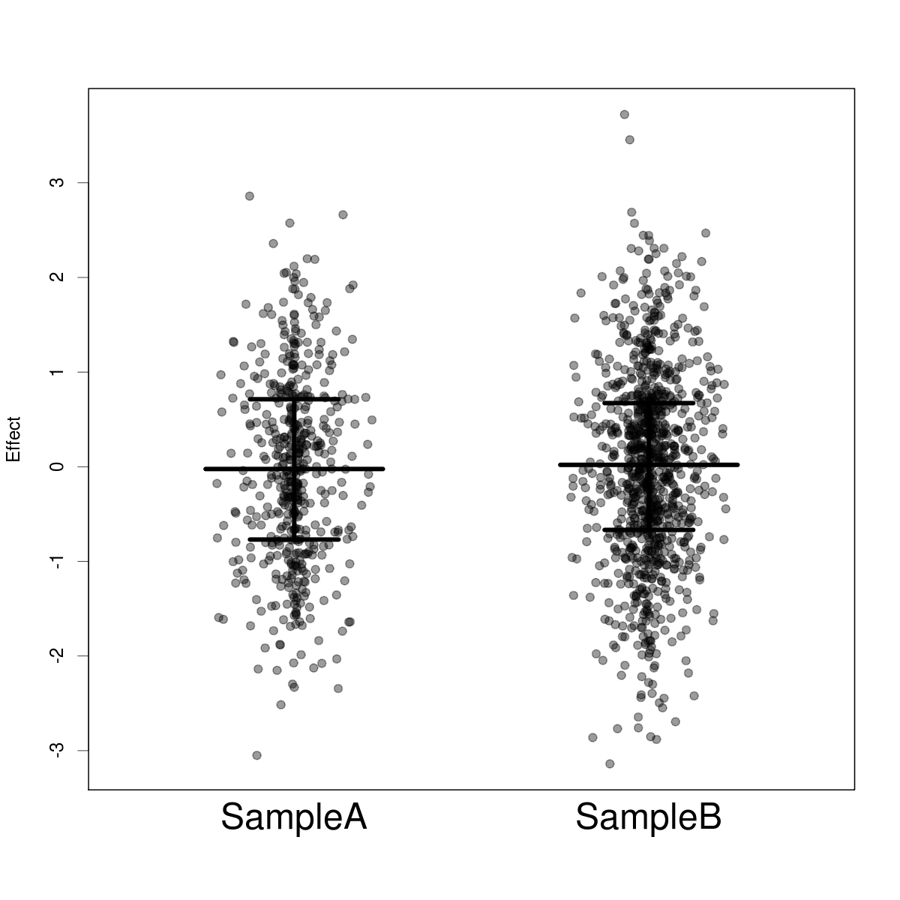

# jitterplot

Jitterplot is an R package for visualizing distributions, similar to the ones generated by Graphpad prism software. See the left panel in this example:

[Graphpad prism plot](http://www.graphpad.com/guides/prism/6/statistics/embim16.jpg)

Example output of the jitterplot routine is shown below:

